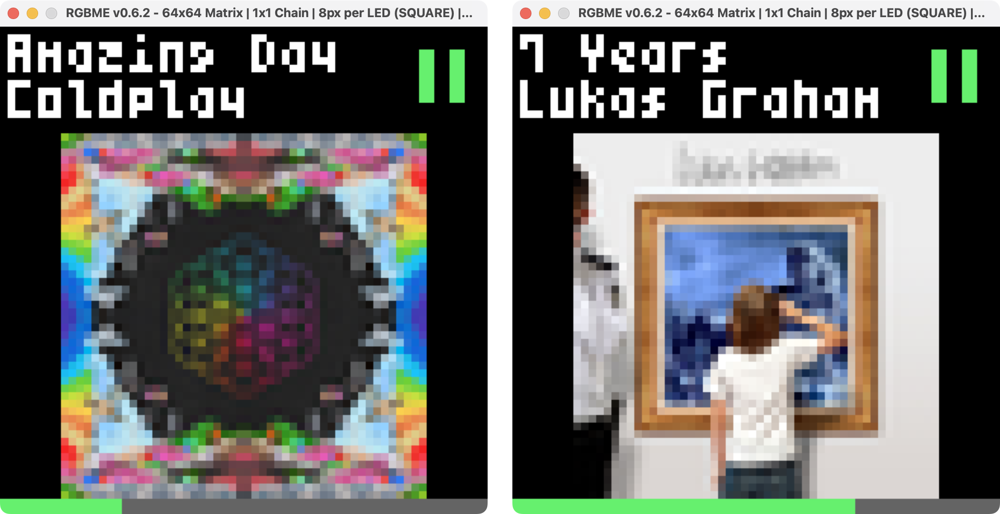

# rpi-spotify-matrix-display

A Spotify display for 64x64 RGB LED matrices

## Spotify Pre-Setup
1. Go to https://developer.spotify.com/dashboard
2. Create an account and/or login
3. Select "Create an app" (name/description does not matter)
4. Copy the generated Client ID and Secret ID for later
5. Lastly, tap "Edit settings" and add http://localhost:8080/callback under Redirect URIs

## Setup
1. Clone the repo
2. Enter the directory:
   - `cd rpi-spotify-matrix-display/`
3. **Set your Client ID and Secret ID in the config.ini**
4. Update git submodules:
   - `git submodule update --init --recursive`
5. Install emulator dependencies (if not wanting to run emulated, you can skip this step):
   - `pip install RGBMatrixEmulator`
6. Run the app ([see below](#how-to-run))
   - More dependencies may need to be installed via pip depending on your machine
7. Authorize Spotify
   - After running, follow instructions provided in the console. Pasted link should begin with http://localhost:8080/callback
8. Enjoy!
   - After successful authorization, play a song and the display will appear

## How to Run
You can either run this project in an emulated state (separate window, browser, etc) or on an RGB LED matrix directly. Commands must be run from the `impl/` directory.

- To run emulated (on a PC/laptop):
    - `python3 controller_v3.py -e`
- To run on a matrix (connected to a raspberry pi), run elevated:
    - `sudo python3 controller_v3.py`

Options:
| Argument | Default | Description |
| :- | :- | :- |
|`-e` , `--emulated`| false | Run in a matrix emulator |
|`-f` , `--fullscreen`| false | Always display album art in full screen (64x64) |
|`-h` , `--help`| false | Display help messages for arguments |

## Configuration
Configuration is handled in the config.ini. I have included my own as a sample.

For Matrix configuration, see https://github.com/hzeller/rpi-rgb-led-matrix#changing-parameters-via-command-line-flags. More extensive customization can be done in impl/controller_v3.py directly.

For Spotify configuration, set the client_id and client_secret to your own. You may leave redirect_uri alone. I have also included a device_whitelist (disabled by default).

## Acknowledgements
Thanks to allenslab for providing the original codebase for this project, [matrix-dashboard](https://github.com/allenslab/matrix-dashboard). You can find his original reddit post [here](https://www.reddit.com/r/3Dprinting/comments/ujyy4g/i_designed_and_3d_printed_a_led_matrix_dashboard/). This project is an adaption of his Spotify app for 64x64 matrices, while also packing some other improvements.

Thanks to ty-porter for [his fork](https://github.com/ty-porter/matrix-dashboard) of matrix-dashboard from which my development branched from. The emulation support his [RGBMatrixEmulator project](https://github.com/ty-porter/RGBMatrixEmulator) added made it a breeze to develop efficiently.

And finally, thanks to hzeller for his work on [rpi-rgb-led-matrix](https://github.com/hzeller/rpi-rgb-led-matrix).